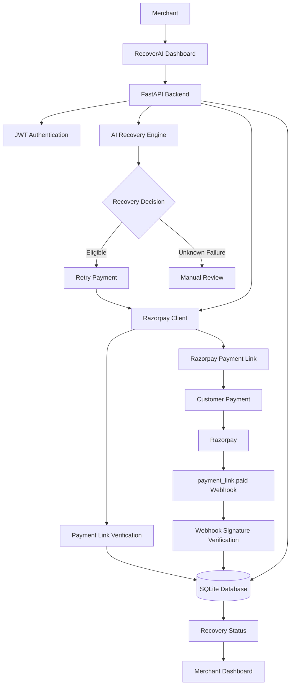

# RecoverAI

### AI-Powered Revenue Recovery Agent for Failed Payments

RecoverAI is an AI-powered revenue recovery system built for merchants to identify failed payments, analyze failure conditions, determine the appropriate recovery action, initiate Razorpay Payment Links, and verify successful recovery.

The system converts failed payments from passive revenue leakage into an actionable, trackable recovery workflow.

---

## Problem

Failed payments represent direct revenue leakage for merchants.

A payment may fail because of factors such as:

- Card-related failures
- Temporary payment issues
- Invalid or unsupported payment conditions
- Unknown failures requiring manual intervention

Without an automated recovery workflow, merchants must manually identify failed transactions, decide what action to take, contact customers, and determine whether a recovery attempt was successful.

RecoverAI addresses this workflow end-to-end.

---

## Solution

RecoverAI provides a merchant-facing dashboard and backend recovery engine that:

1. Identifies failed transactions.
2. Analyzes transaction failure information.
3. Determines an appropriate recovery action.
4. Assigns a recovery priority.
5. Generates a Razorpay Payment Link for eligible transactions.
6. Stores the recovery state and Payment Link information.
7. Verifies successful recovery through Razorpay Payment Link status.
8. Processes Razorpay webhooks securely.
9. Updates the transaction to `recovered` only after successful payment verification.
10. Provides merchants with recovery metrics and transaction-level visibility.

---

## Key Features

### AI Recovery Decision Engine

RecoverAI analyzes failed transactions and determines whether they are suitable for automated recovery.

Example decision:

```text
Failed Payment
      |
      v
Analyze Failure
      |
      +---- Card + BAD_REQUEST_ERROR
      |          |
      |          v
      |    Retry Payment
      |       Priority: High
      |
      +---- Unknown Failure
                 |
                 v
           Manual Review
```

The decision includes:

- Recovery action
- Reason
- Priority
- Eligibility

---

### Razorpay Payment Recovery

For eligible failed payments, RecoverAI creates a Razorpay Payment Link.

Each recovery link is associated with the original transaction using a unique reference:

```text
recovery_<payment_id>
```

Example:

```text
recovery_pay_test_005
```

The generated Payment Link and Razorpay Payment Link ID are stored in the database.

---

### Duplicate Payment Link Prevention

Razorpay Payment Links require unique reference IDs.

RecoverAI checks whether a recovery link already exists before creating another one.

If an existing recovery link is available, it is reused instead of creating a duplicate.

This prevents errors caused by repeated recovery attempts.

---

### Recovery Verification

RecoverAI does not consider a transaction recovered simply because a recovery link was created.

It verifies the actual Razorpay Payment Link status.

The recovery lifecycle is:

```text
initiated
    |
    v
pending
    |
    v
paid
    |
    v
recovered
```

A transaction is marked as `recovered` only after the corresponding recovery payment has been successfully verified.

---

### Razorpay Webhook Integration

RecoverAI supports Razorpay `payment_link.paid` webhooks.

Webhook requests are validated using the Razorpay webhook signature before processing.

The workflow is:

```text
Razorpay
    |
    | payment_link.paid
    v
Webhook Endpoint
    |
    | Signature Verification
    v
Extract Reference ID
    |
    | recovery_<payment_id>
    v
Identify Original Transaction
    |
    v
Mark Recovery as Recovered
```

Supported webhook events configured for the project include:

- `payment.failed`
- `payment.captured`
- `payment_link.paid`

---

### Merchant Dashboard

The dashboard provides a centralized view of recovery performance.

It displays:

- Revenue at Risk
- Revenue Recovered
- Recovery Rate
- Failed Payments
- Recovery Links
- Recovery Performance
- AI Recovery Engine decision
- Recent Failed Payments

Merchants can also inspect individual transactions and their recovery information.

---

### Transaction Management

The application includes dedicated views for:

- All transactions
- Failed transactions
- Recovery records
- Individual transaction details
- Recovery status

Each transaction can expose information such as:

- Payment ID
- Order ID
- Amount
- Currency
- Payment status
- Failure information
- Recovery status
- Recovery Payment Link
- Razorpay Payment Link ID

---

### Authentication & Authorization

RecoverAI includes JWT-based authentication for merchant-facing APIs.

The authentication system includes:

- Login endpoint
- Password hashing using PBKDF2-HMAC-SHA256
- JWT access tokens
- Protected API routes
- Authenticated frontend requests
- Token expiry
- Logout
- Unauthorized request handling

Sensitive configuration values are stored in environment variables rather than committed to Git.

---

## Architecture



### Core Components

| Component | Responsibility |
|---|---|
| `FastAPI` | Backend API and application server |
| `AI Recovery Engine` | Failure analysis and recovery decision |
| `Razorpay Client` | Razorpay API integration |
| `Recovery Actions` | Payment Link creation and reuse |
| `Recovery Verification` | Payment Link status verification |
| `Webhook Handler` | Secure Razorpay webhook processing |
| `SQLite` | Transaction and recovery state persistence |
| `JWT Authentication` | Merchant API authentication |
| `HTML/CSS/JavaScript` | Merchant dashboard |

---

## Technology Stack

### Backend

- Python
- FastAPI
- Uvicorn
- SQLite
- PyJWT
- PBKDF2-HMAC-SHA256 password hashing
- Razorpay Python SDK

### Frontend

- HTML5
- CSS3
- JavaScript
- Bootstrap / custom dashboard styling

### Testing

- Pytest
- HTTPX
- FastAPI TestClient

### Payment Infrastructure

- Razorpay Test Mode
- Razorpay Payment Links
- Razorpay Webhooks

---

## Project Structure

```text
recoverai/
│
├── backend/
│   │
│   ├── app/
│   │   ├── __init__.py
│   │   ├── main.py
│   │   ├── auth.py
│   │   ├── config.py
│   │   ├── database.py
│   │   ├── dashboard.py
│   │   ├── razorpay_client.py
│   │   ├── recoveries.py
│   │   ├── recovery_actions.py
│   │   ├── recovery_engine.py
│   │   ├── recovery_service.py
│   │   ├── recovery_verification.py
│   │   ├── routes.py
│   │   ├── webhooks.py
│   │   │
│   │   └── services/
│   │       └── risk_engine.py
│   │
│   ├── frontend/
│   │   ├── index.html
│   │   ├── login.html
│   │   ├── recoveries.html
│   │   ├── transactions.html
│   │   ├── transaction.html
│   │   ├── settings.html
│   │   ├── app.js
│   │   ├── auth.js
│   │   ├── login.js
│   │   ├── recoveries.js
│   │   ├── transactions.js
│   │   ├── transaction.js
│   │   ├── settings.js
│   │   └── style.css
│   │
│   ├── scripts/
│   │   ├── check_transactions.py
│   │   ├── migrate_recovery.py
│   │   └── test_webhook.py
│   │
│   ├── tests/
│   │   └── test_api.py
│   │
│   ├── requirements.txt
│   └── .gitignore
│
└── README.md
```

---

## Recovery Workflow

The complete recovery workflow is:

```text
1. Payment fails
        ↓
2. Transaction is stored
        ↓
3. RecoverAI analyzes failure
        ↓
4. Recovery action is selected
        ↓
5. Eligible transaction receives a Razorpay Payment Link
        ↓
6. Payment Link ID is stored
        ↓
7. Customer completes payment
        ↓
8. Razorpay confirms payment
        ↓
9. Webhook and/or Payment Link verification
        ↓
10. Recovery marked as "recovered"
        ↓
11. Dashboard metrics update
```

---

## Example Recovery Decision

A failed transaction containing:

```text
status = failed
error_code = BAD_REQUEST_ERROR
method = card
```

is classified as eligible for automated retry.

Example result:

```json
{
    "action": "retry_payment",
    "priority": "high"
}
```

Unknown failure conditions can instead be routed to:

```json
{
    "action": "manual_review"
}
```

---

## API Endpoints

### General

| Method | Endpoint | Description |
|---|---|---|
| `GET` | `/` | API/application status |
| `GET` | `/health` | Health check |

### Authentication

| Method | Endpoint | Description |
|---|---|---|
| `POST` | `/auth/login` | Authenticate merchant |
| `GET` | `/auth/me` | Get authenticated user |

### Dashboard

| Method | Endpoint | Description |
|---|---|---|
| `GET` | `/dashboard/summary` | Recovery metrics |
| `GET` | `/dashboard/transactions` | Transaction listing |
| `GET` | `/dashboard/transactions/{payment_id}` | Transaction details |

### Recoveries

| Method | Endpoint | Description |
|---|---|---|
| `GET` | `/recoveries` | List recovery records |
| `PATCH` | `/recoveries/{payment_id}/status` | Update recovery status |
| `GET` | `/recovery/verify/{payment_id}` | Verify recovery payment |

### Razorpay

| Method | Endpoint | Description |
|---|---|---|
| `POST` | `/razorpay/test-order` | Create test order |
| `POST` | `/razorpay/test-transaction` | Create test transaction |
| `GET` | `/razorpay/recovery/analyze/{payment_id}` | Analyze failed payment |
| `POST` | `/razorpay/recovery/execute/{payment_id}` | Execute recovery |

### Webhooks

| Method | Endpoint | Description |
|---|---|---|
| `POST` | `/webhooks/razorpay` | Process Razorpay webhook |

---

## Security

RecoverAI implements several security controls.

### Authentication

Merchant APIs are protected using JWT bearer tokens.

### Password Security

Passwords are not stored in plaintext. PBKDF2-HMAC-SHA256 is used for password hashing.

### Webhook Security

Razorpay webhook signatures are validated using the configured webhook secret before processing webhook events.

### Secret Management

The following credentials are loaded through environment variables:

```text
RAZORPAY_KEY_ID
RAZORPAY_KEY_SECRET
RAZORPAY_WEBHOOK_SECRET
RECOVERAI_JWT_SECRET
RECOVERAI_ADMIN_USERNAME
RECOVERAI_ADMIN_PASSWORD
```

The `.env` file is excluded from Git using `.gitignore`.

---

## Environment Variables

Create a `.env` file inside `backend/`:

```env
RAZORPAY_KEY_ID=your_razorpay_test_key_id
RAZORPAY_KEY_SECRET=your_razorpay_test_key_secret
RAZORPAY_WEBHOOK_SECRET=your_razorpay_webhook_secret

RECOVERAI_JWT_SECRET=your_long_random_jwt_secret

RECOVERAI_ADMIN_USERNAME=demo_user
RECOVERAI_ADMIN_PASSWORD=recoverai_2026
```

**Never commit `.env` or real API credentials to GitHub.**

---

## Local Setup

### 1. Clone the repository

```bash
git clone https://github.com/plskillrida/recoverai.git
cd recoverai
```

### 2. Enter the backend

```bash
cd backend
```

### 3. Create a virtual environment

Windows:

```powershell
python -m venv venv
.\venv\Scripts\activate
```

Linux/macOS:

```bash
python3 -m venv venv
source venv/bin/activate
```

### 4. Install dependencies

```bash
pip install -r requirements.txt
```

### 5. Configure environment variables

Create:

```text
backend/.env
```

and add the required variables shown above.

### 6. Start the backend

From the `backend` directory:

```bash
uvicorn app.main:app --reload
```

The API will be available at:

```text
http://127.0.0.1:8000
```

Swagger API documentation:

```text
http://127.0.0.1:8000/docs
```

---

## Running the Frontend

The frontend is a static HTML/CSS/JavaScript application.

The main dashboard is:

```text
backend/frontend/index.html
```

For local development, the frontend can be opened using a local static server such as VS Code Live Server.

Example:

```text
http://127.0.0.1:5500
```

Open:

```text
login.html
```

and authenticate using the configured merchant credentials.

---

## Demo Flow

The recommended demonstration flow is:

```text
Login
  ↓
Dashboard
  ↓
View Failed Payment
  ↓
AI Recovery Analysis
  ↓
Execute Recovery
  ↓
Razorpay Payment Link
  ↓
Customer Payment
  ↓
Recovery Verification
  ↓
Recovered Transaction
  ↓
Updated Dashboard
```

A test transaction can be created through:

```text
POST /razorpay/test-transaction
```

The recovery can then be executed through:

```text
POST /razorpay/recovery/execute/{payment_id}
```

and verified through:

```text
GET /recovery/verify/{payment_id}
```

---

## Testing

RecoverAI includes an automated API test suite.

Run:

```bash
cd backend
pytest -v
```

The project contains **30 automated test cases** covering:

- Missing login credentials
- Invalid username
- Invalid password
- Unauthorized API access
- JWT authentication
- Invalid JWT tokens
- Malformed authorization headers
- Root endpoint
- Health endpoint
- Invalid transaction requests
- Recovery verification
- Missing webhook signatures
- Invalid webhook signatures
- Malformed webhook payloads
- Dashboard authentication
- Dashboard summary
- Dashboard transactions
- Recovery listing
- Existing transactions
- Missing transactions
- Public Swagger documentation
- OpenAPI endpoint
- Public webhook endpoint

Test result:

```text
30 passed
```

---

## Example Recovery Verification

Before payment completion:

```json
{
    "verified": false,
    "status": "pending",
    "razorpay_status": "created"
}
```

After successful payment:

```json
{
    "verified": true,
    "status": "recovered",
    "razorpay_status": "paid"
}
```

This distinction ensures that an initiated recovery is not incorrectly counted as a successful recovery.

---

## Razorpay Integration

RecoverAI uses Razorpay Test Mode for the payment recovery workflow.

The integration covers:

- Test orders
- Test transactions
- Payment failure analysis
- Payment Link creation
- Payment Link reuse
- Payment Link status verification
- Webhook processing
- Webhook signature verification

No production payment credentials are required for the demo.

---

## Current Scope

The current MVP focuses on the core revenue recovery workflow:

- Failed payment detection
- Failure analysis
- Recovery decisioning
- Razorpay Payment Link generation
- Recovery state management
- Payment verification
- Webhook processing
- Merchant dashboard
- Authentication
- Automated testing

The implementation focuses on demonstrating the complete recovery loop rather than adding non-essential features around it.

---

## Future Improvements

Potential extensions include:

- Customer communication through email/SMS/WhatsApp
- More sophisticated failure classification
- ML-based recovery probability scoring
- Recovery strategy optimization
- Automated retry scheduling
- Merchant-configurable recovery policies
- Historical recovery analytics
- Persistent production-grade database
- Background task processing
- Multi-merchant authentication and isolation
- Production deployment and observability

---

## Project Status

**RecoverAI MVP — Complete**

Implemented:

- [x] FastAPI backend
- [x] Razorpay Test Mode integration
- [x] AI recovery decision engine
- [x] Payment Link generation
- [x] Duplicate recovery prevention
- [x] Payment Link verification
- [x] Razorpay webhook integration
- [x] Webhook signature verification
- [x] SQLite persistence
- [x] JWT authentication
- [x] Merchant dashboard
- [x] Transaction management
- [x] Recovery management
- [x] Recovery status tracking
- [x] 30 automated API tests
- [x] Responsive dark merchant UI

---

## Demo Credentials

For the local demo environment:

```text
Username: demo_user
Password: recoverai_2026
```

These credentials are intended only for the RecoverAI demonstration environment.

---

## Author

**Rida Fatima**

RecoverAI was developed as an AI-powered revenue recovery solution using FastAPI and Razorpay Test Mode.

---

## License

This project is provided for demonstration and educational purposes.
